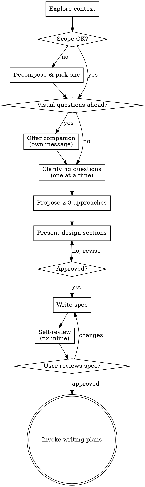

# Brainstorming Ideas Into Designs

Turn ideas into approved designs through short, focused dialogue. The terminal state is invoking **writing-plans**; never jump straight to implementation skills.

## Hard gate

<HARD-GATE>
No code, no scaffolding, no implementation skills until a design is presented AND the user has explicitly approved it. This applies regardless of perceived simplicity. A todo list, a one-line config change, a "trivial" utility — all of them get a design. The design can be three sentences for truly small work, but it must exist and be approved.
</HARD-GATE>

## Checklist

Create one task per item and complete in order:

1. **Explore project context** — read relevant files, docs, recent commits before asking anything.
2. **Triage scope.** If the request bundles multiple independent subsystems, decompose it first. Pick the first sub-project, brainstorm only that. Each sub-project gets its own spec → plan → implementation cycle.
3. **Offer visual companion** (only if upcoming questions are genuinely visual). Send the offer as its own message — no other content, no clarifying question attached. See [Visual companion](#visual-companion).
4. **Ask clarifying questions** — one per message, prefer multiple-choice, focus on purpose / constraints / success criteria.
5. **Propose 2–3 approaches** with trade-offs. Lead with your recommendation and explain why.
6. **Present the design in sections.** Scale each section to its complexity. Get approval after each section before moving on.
7. **Write the spec** to `docs/superpowers/specs/YYYY-MM-DD-<topic>-design.md` (or the user's preferred location). Commit it.
8. **Self-review the spec** — fix inline, no second pass needed. See [Spec self-review](#spec-self-review).
9. **Ask the user to review** the committed spec file. Wait for approval. If they request changes, edit and re-run step 8.
10. **Hand off to writing-plans.** Only `writing-plans`. Not `frontend-design`, not `mcp-builder`, not anything else.

## Process flow

## Asking clarifying questions

- **One per message.** Multiple questions in one message dilute the answer.
- **Multiple-choice when possible.** Easier to answer; surfaces options the user hadn't considered.
- **Focus on the gap, not the obvious.** Don't ask things the project state already answers — read the repo first.
- **No follow-up questions in the same message.** If a topic needs three questions, that's three messages.
- **Open-ended is fine** when the option space is genuinely unknown.

## Proposing approaches

- 2–3 options, not more (more is overwhelming and almost always padded).
- Each option gets: what it is, the trade-off vs. the others, when you'd pick it.
- State your recommendation first, then explain. Don't bury the lede.
- If one approach is obviously right, say so — don't manufacture alternatives to fill space.

## Presenting the design

Cover these, scaled to complexity:

- **Architecture** — the shape of the thing.
- **Components / units** — each with one clear purpose, defined interface, independent testability.
- **Data flow** — what moves where, and when.
- **Error handling** — what can fail, what happens when it does.
- **Testing** — how we'll know it works.

A few sentences each is fine. 200–300 words is the upper bound, and only for genuinely nuanced sections. Ask for approval after each section so you don't waste effort on a wrong premise.

### Design for isolation

For each unit, you should be able to answer in one sentence: **what does it do, how do you use it, what does it depend on?** If you can't, the boundaries need work. A file that's grown too large is usually doing too much — split it.

### Working in existing codebases

- Read the surrounding code first. Follow existing patterns.
- If existing code blocks the work (file too large, tangled responsibilities), include the targeted fix as part of this design — the way a careful developer improves code they're already inside.
- Do not propose unrelated refactoring. Stay focused.

## Spec self-review

After writing, look at the spec with fresh eyes and fix inline:

1. **Placeholders** — any `TBD`, `TODO`, or vague requirements? Resolve them.
2. **Internal consistency** — sections agree with each other? Architecture matches the feature list?
3. **Scope** — single-plan sized, or does it need further decomposition?
4. **Ambiguity** — any requirement readable two ways? Pick one and make it explicit.

Then prompt the user:

> Spec written and committed to `<path>`. Please review it and let me know if you want changes before we start the implementation plan.

## Visual companion

A browser-based tool for showing mockups, diagrams, and visual comparisons. It is **available on demand**, not a mode you live in.

**Offer it only when upcoming questions are genuinely visual.** "Which wizard layout works better?" → visual. "What does 'personality' mean here?" → text. A UI topic does not automatically mean a visual question.

**The offer is its own message.** No clarifying question piggy-backed:

> Some of what we're working on might be easier to explain if I can show it to you in a web browser. I can put together mockups, diagrams, and side-by-side comparisons. This feature is still new and can be token-intensive. Want to try it? (Requires opening a local URL)

After acceptance, decide **per question**: would the user understand this better seeing it than reading it? If no, stay in the terminal even though the companion is available.

If the user accepts, read `skills/brainstorming/visual-companion.md` before sending the first visual.

## Key principles

- **One question at a time.**
- **YAGNI ruthlessly** — strip speculative features from every design.
- **Lead with the recommendation.** Reasoning second.
- **Validate incrementally.** Approve sections, not whole walls of text.
- **Be willing to back up.** If a later question reveals the earlier premise was wrong, go back and fix it instead of patching forward.
